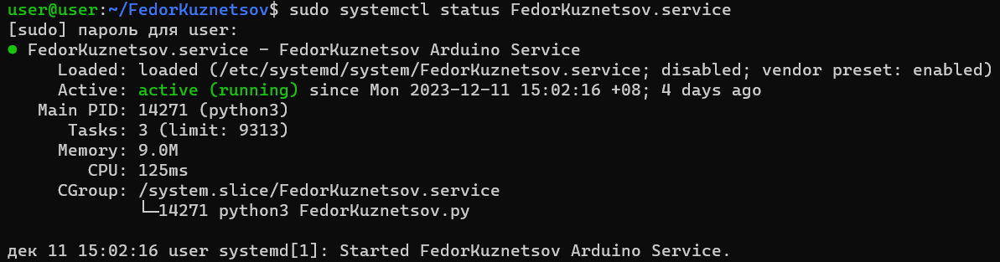

# Самая надежная программа

Написать программу для получения данных через ZMQ(порт 5555). Программа должна получать данные о состоянии
фоторезистора, кнопки и геркона и записывать эти события для дальнейшего использования. Необходимо фиксировать время
каждого события.

https://github.com/Krushiler/arduino_sensor_reader

Запустить программу на тестовом ноутбуке при помощи systemd.

