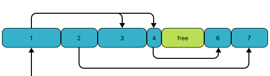
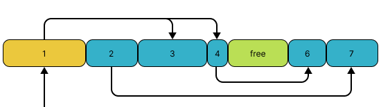
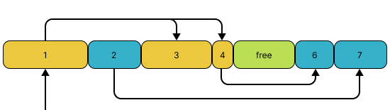
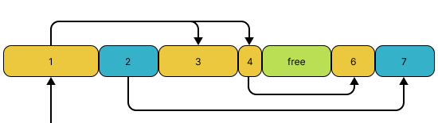
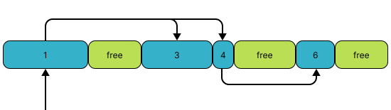
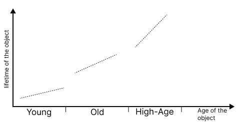
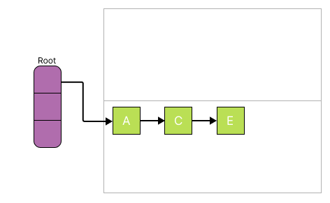
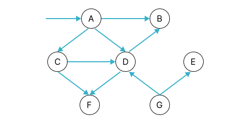
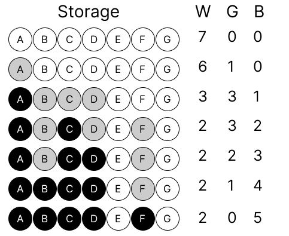

# Разновидности сборщиков мусора (Garbage Collector)

<details>

<summary>Оглавление</summary>

1. **[Определение сборщика мусора и его роль в управлении памятью](#определение-сборщика-мусора-и-его-роль-в-управлении-памятью)**
2. **[Основные типы GC](#▌основные-типы-gc)**
   - 2.1 [Ручные GC](#ручные-gc)
   - 2.2 [Автоматические GC](#автоматические-gc)
3. **[Алгоритмы работы GC](#▌алгоритмы-работы-gc)**
   - 3.1 [Алгоритм "Mark and Sweep"](#алгоритм-mark-and-sweep)
   - 3.2 [Алгоритм выставления флагов](#алгоритм-выставления-флагов-mark-and-flag)
   - 3.3 [Алгоритм подсчета ссылок](#алгоритм-подсчета-ссылок-reference-counting)
   - 3.4 [Алгоритм поколений](#алгоритм-поколений-generational)
   - 3.5 [Алгоритм "Copying"](#алгоритм-copying)
   - 3.6 [Алгоритм трёх цветов](#алгоритм-трёх-цветов-tricolor-algorithms)
   - 3.7 [Incremental garbage collector](#incremental-garbage-collector)
4. **[Примеры использования](#▌примеры-использования)**
   - 4.1 [Python](#python)
   - 4.2 [.NET](#net)
   </details>

## Определение сборщика мусора и его роль в управлении памятью

Сборщик мусора - это часть системы управления памятью, которая автоматически освобождает память от объектов, которые больше не используются приложением. Роль сборщика мусора заключается в предотвращении утечек памяти и оптимизации использования имеющейся памяти.

## ▌Основные типы GC

### Ручные GC

В ручном сборщике мусора программист самостоятельно отслеживает создание и освобождение объектов в памяти.
Программист имеет полный контроль над управлением памятью, что позволяет избегать неэффективных сборок мусора и оптимизировать работу программы.

Преимущества:

- Эффективное использование ресурсов, так как сборка мусора происходит точно по мере необходимости.
- Минимизация задержек, связанных с автоматической сборкой мусора.

Недостатки:

- Подвержен риску утечек памяти, если программист забудет освободить объекты.
- Требует более высокой ответственности и внимательности со стороны программиста.

Примеры языков программирования с ручным управлением памятью: **C**, **C++**, **Rust**.

### Автоматические GC

Автоматический сборщик мусора определяет объекты в памяти, которые больше не доступны и могут быть безопасно удалены.
GC работает в фоновом режиме, периодически проверяя и освобождая память от недостижимых объектов. Это происходит без участия программиста.

Преимущества:

- Уменьшает риск утечек памяти, так как позволяет избежать забытых объектов.
- Упрощает разработку, так как программисту не нужно вручную отслеживать и освобождать память.

Недостатки:

- Может внести задержки в работу программы при выполнении сборки мусора.

Примеры языков программирования с автоматическим сборщиком мусора: **Python**, **Java**, **C#**, **JavaScript** _(в браузерах)_, **Ruby**.

## ▌Алгоритмы работы GC

1. ### **Алгоритм "Mark and Sweep"**:

   Этот алгоритм состоит из двух этапов - маркировки и освобождения. На первом этапе сборщик мусора помечает все объекты, которые все еще используются приложением (маркируются путем установки специальных маркеров (обычно битовых флагов) внутри самих объектов). На втором этапе сборщик мусора освобождает память от недостижимых объектов.

   Языки: **Golang**, **Ruby**

   ### Пример

   

   _Старт: граф неразмеченных объектов_

   

   _Разметка — шаг 1: Покрасили объект 1.<br>Пул объектов, которые связаны с объектом 1 — 3 и 4._

   

   _Разметка — шаг 2: Покрасили объекты 3 и 4.<br>Пул объектов, связанных с окрашенной частью графа — 6:_

   

   _Разметка — шаг 3: Покрасили объект 6.<br>Объектов, связанных с окрашенной частью графа, не осталось.<br>Пришло время чистить мусор._

   

   _Очистка: Объекты 2 и 7 недостижимы, их можно освободить._

   

   _Память недостижимых объектов отмечается доступной для перезаписи или сразу возвращается системе._

   > Чтобы операция прошла корректно, программа должна быть приостановлена во время стадии разметки (Mark). Такая пауза в выполнении называется Stop The World (STW).

   Алгоритм "Mark and Sweep" может быть эффективным для приложений с большим количеством долгоживущих объектов. Однако он может привести к простоям приложения из-за того, что на этапе маркировки приложению необходимо остановиться и подождать, пока сборщик мусора пройдет по всем объектам.

2. ### **Алгоритм выставления флагов** (_"Mark and Flag"_):

   Этот алгоритм изменяет алгоритм "Mark and Sweep", чтобы сделать его более эффективным. Вместо того, чтобы помечать объекты, которые все еще используются приложением, он создаёт отдельные структуры данных, называемые буфером (flag buffer) или стеком, в который добавляются ссылки на "живые" объекты. Затем сборщик мусора проходит по всем объектам и освобождает те, у которых флаг не выставлен.

   Языки: **Smalltalk**

   Алгоритм выставления флагов может быть эффективен для приложений, которые создают и удаляют объекты постоянно, но может быть неэффективным для приложений, которые работают с большим количеством долгоживущих объектов.

3. ### **Алгоритм подсчета ссылок** (_"Reference Counting"_):

   Этот алгоритм следит за количеством ссылок на каждый объект. Каждый раз, когда создается ссылка на объект, счетчик ссылок увеличивается, а когда ссылка удаляется, счетчик ссылок уменьшается. Когда счетчик ссылок объекта достигает нуля, объект освобождается.

   Языки: **Python**, **Objective-C** (оба языка частично)

   

   _Пока существуют ссылки на объект, он не удаляется_

   

   _Как только объект не имеет ссылок, он может быть удалён_

   Алгоритм подсчета ссылок может быть эффективным для объектов с коротким временем жизни, но может привести к проблемам с циклическими ссылками, когда объекты ссылаются друг на друга. В таких случаях более подходящим может быть использование алгоритма "Mark and Sweep" или других алгоритмов сборки мусора.

4. ### **Алгоритм поколений** (_"Generational"_):

   Этот алгоритм использует три поколения сборщиков мусора и оптимизирует сборку мусора для каждого поколения.

   

   - Молодое поколение (**Young Generation**): В этом поколении помещаются новые объекты. Сборка мусора в молодом поколении выполняется часто и быстро. После некоторого числа итераций сборки молодых объектов, система может выполнить сборку старого поколения.

   - Старое поколение (**Old Generation**): Это поколение содержит долгоживущие объекты, которые выжили несколько сборок молодых. Сборка мусора в старом поколении выполняется реже, но более тщательно, и может занимать больше времени.

   - Поколение "высокого возраста" (**High-Age Generation**): Некоторые системы сборки мусора могут иметь дополнительное поколение для объектов с очень долгим сроком службы.

   Сборщик мусора может проходить реже для объектов из старших поколений, что уменьшает нагрузку на процессор и улучшает производительность приложения.

   Языки: **.NET**, **Python**

   Алгоритм "Generational" может быть эффективным для приложений с разными типами объектов, которые имеют разное время жизни. Однако он может потреблять больше памяти, так как каждое поколение должно храниться в отдельной области памяти.

5. ### **Алгоритм "Copying"**:

   Процесс сборки мусора алгоритмом копирования - это фактически процесс копирования уцелевших объектов из одной половины кучи в другую половину.

   

   

   Алгоритм "Copying" может быть эффективным для приложений с большим количеством создаваемых и удаляемых объектов, т.к. может выполнять упорядочивание памяти во время процесса копирования, поэтому больше не будет проблем с фрагментацией памяти и нет необходимости специализироваться на сжатии памяти. Но он потребляет больше памяти, т.к. приложение должно держать в памяти две области.

6. ### **Алгоритм трёх цветов** (_"Tricolor Algorithms"_):

   В этом алгоритме, процесс сборки мусора начинается с разметки. Все объекты окрашиваются в чёрный, серый или белый цвет:

   - **Белый:** Отражает потенциальный мусор или объекты, ещё не оцененные алгоритмом.

   - **Серый:** Объекты "на рассмотрении".

   - **Чёрный:** Представляет активные объекты, которые прошли проверку.

   Языки: **Golang**, **Python**

   В начале процесса все объекты на куче и стеке обозначаются белым цветом.

   Алгоритм можно представить как цикл:

   1. Перекрасить все корневые объекты (стек и глобальные переменные) в серый.

   2. Выбрать серый объект из пула серых и отметить его, как чёрный.

   3. Пометить серым все объекты, на которые указывает чёрный объект. Это гарантирует сохранность самого объекта и тех, на кого он ссылается, от удаления.

   4. Если в графе ещё остаются серые объекты, возврат к шагу ii.

   Узлы на приведенном ниже графике указывают на объекты в памяти, а стрелки указывают ссылки на другие объекты:

   

   Начиная с A (как корневого узла), отмечаем его серым цветом, что означает, что он доступен, и мы обрабатываем его в данный момент. Из A мы можем связаться с C, D и B.

   Далее маркируем A черным цветом (объект безопасен и не подлежит сбору мусора).

   Затем аналогично с объектом C. Мы можем достичь F и D из C, который, в свою очередь, имеет корень A. Поэтому мы отмечаем C черным цветом.

   Далее, из D мы можем связаться с B, поэтому отмечаем D черным цветом.

   Аналогично, мы можем добраться до B и F, поэтому также пометим их черным цветом.

   Когда не остается серых объектов, мы видим что G и E остались белыми, следовательно они являются кандидатами на сборку мусора.

   

   Если выполнять данный алгоритм без инкрементального сборщика мусора, то он ничем не отличаетя от Mark and Sweep

7. ### **Incremental garbage collector**:

   Инкрементальный сборщик мусора (Incremental Garbage Collector) - это вид сборщика мусора, который осуществляет процесс сборки мусора поэтапно, разбивая его на несколько мелких этапов. Это делается для того, чтобы минимизировать влияние сборки мусора на работу программы и сделать этот процесс более плавным.

   Языки: **Unity**, **.NET**, **Java**

   В отличие от обычного сборщика мусора, который может останавливать выполнение программы на продолжительное время, инкрементальный сборщик мусора позволяет сборку выполнять частично, внедряя этапы сборки в промежутки между нормальной работой программы.

   Преимущества инкрементальной сборки мусора включают в себя более низкую степень простоя программы, что особенно важно для реального времени и интерактивных приложений. Однако, реализация инкрементального сборщика может быть сложной, и он может потреблять больше ресурсов в сравнении с простыми схемами сборки мусора.

## ▌Примеры использования

### Python

**Тестовый класс**

```python
class GarbageCollectorExample:
    def __init__(self, value):
        self.value = value

    def __del__(self):
        print(f"Object with value {self.value} is being destroyed.")
```

**[Ручная сборка](code_samples/python/example_1.py)**

```python
# Отлючаем автоматическую сборку при потере ссылки на объект
gc.disable()

# Создаем список объектов
objects_list = [GarbageCollectorExample(i) for i in range(1, 6)]

# Сохраняем ссылку на второй объект
object_save = objects_list[1]

# Обнуляем ссылку на список объектов
objects_list = None

# Запускаем сборщик мусора
start_time = time.time()
gc.collect()
end_time = time.time()

print(f"Время выполнения сборщика мусора - {end_time - start_time} секунд")
```

**Вывод**

```python
Object with value 5 is being destroyed.
Object with value 4 is being destroyed.
Object with value 3 is being destroyed.
Object with value 1 is being destroyed.
Время выполнения сборщика мусора - 0.0015037059783935547 секунд
Object with value 2 is being destroyed.
```

**[Автоматическая сборка](code_samples/python/example_2.py)**

```python
# Включаем автоматическую сборку при потере ссылки на объект
gc.enable()

# Создаем список объектов
objects_list = [GarbageCollectorExample(i) for i in range(1, 6)]

# Обнуляем ссылку на первый объект в списке
objects_list[0] = None

print(f"Количество объектов в поколениях до сборки мусора: {len(gc.get_objects())}")

# Запускаем сборщик мусора с поколениями
gc.collect(0)  # сборка мусора для первого поколения
gc.collect(1)  # сборка мусора для второго поколения

# Выводим количество объектов в каждом поколении
print(f"Количество объектов в поколениях после сборки мусора: {len(gc.get_objects())}")
```

**Вывод**

```python
Object with value 1 is being destroyed.
Количество объектов в поколениях до сборки мусора: 4845
Количество объектов в поколениях после сборки мусора: 4814
Object with value 2 is being destroyed.
Object with value 3 is being destroyed.
Object with value 4 is being destroyed.
Object with value 5 is being destroyed.
```

### .NET

**Класс с деструктором**

```csharp
class SomeObject
{
    private int Id;

    public SomeObject(int id)
    {
        Id = id;
    }

    ~SomeObject()
    {
        Console.WriteLine($"SomeObject {Id} has been destroyed");
    }
}
```

**Ручная сборка**

```csharp
void Test1()
{
    List<SomeObject> objectList = new List<SomeObject>();

    for (int i = 0; i < 5; i++)
    {
        objectList.Add(new SomeObject(i + 1));
    }
}
```

```csharp
// Тест ручной сборки
Test1();

// Запускаем сборку мусора вручную
GC.Collect();

// Ждём завершения всех финализаторов объектов,
// которые были помечены для уничтожения.
GC.WaitForPendingFinalizers();

Console.WriteLine("Manual garbage collection performed\n");
```

**Вывод**

```csharp
SomeObject 5 has been destroyed
SomeObject 1 has been destroyed
SomeObject 4 has been destroyed
SomeObject 3 has been destroyed
SomeObject 2 has been destroyed
Manual garbage collection performed
```

**Класс с Dispose()**

```csharp
// Класс Person реализует интерфейс IDisposable
public class Person : IDisposable
{
    public string Name { get; }

    public Person(string name) => Name = name;

    // Реализация метода Dispose из интерфейса IDisposable
    public void Dispose() => Console.WriteLine($"{Name} has been disposed");
}
```

**Использование using**

```csharp
void Test2()
{
    // Используем using для автоматического вызова Dispose()
    using (Person tom = new Person("Tom"))
    {
        // Выводим имя объекта
        Console.WriteLine($"Name: {tom.Name}");
    }

    // После завершения using объект tom уничтожается
    Console.WriteLine("Конец метода Test");
}
```

**Вывод**

```csharp
Name: Tom
Tom has been disposed
Конец метода Test
```

---

Источники:

- https://professorweb.ru/my/csharp/optimization/level3/3_3.php
- https://java-online.ru/garbage-collection.xhtml
- https://russianblogs.com/article/58901327872/
- https://habr.com/ru/articles/208256/
- https://medium.com/@diyaz.yakubov/understanding-memory-management-the-key-to-efficient-programming-in-any-language-2f21ee1d7569
